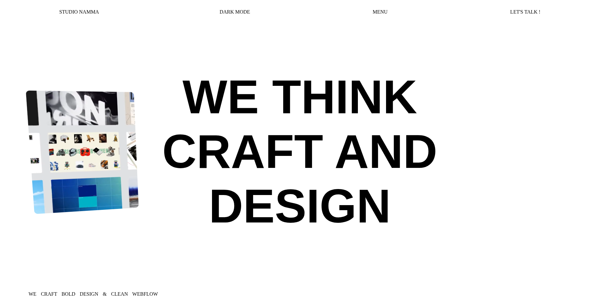

# 🎨 Studio Namma Clone

A responsive front-end clone of the **Studio Namma** website built using **HTML, CSS, and JavaScript**. This project recreates the original website's modern design, smooth animations, and interactive user experience while strengthening front-end development skills.

## 🌐 Live Demo

🔗 [Click Here !!!](https://studio-namma-clone-aj05.vercel.app/)


## ✨ Features

- 🎨 Pixel-perfect Studio Namma landing page
- 📱 Fully responsive design
- 🎥 Vimeo video integration
- 🖱️ Interactive navigation bar
- ✨ Smooth hover and scroll animations
- 🎞️ Animated GIF sections
- 🌙 Dark-themed modern UI
- ⚡ Optimized CSS transitions

## 🛠️ Tech Stack

* HTML5
* CSS3
* JavaScript

## 📁 Project Structure

```text
StudioNamma_Clone/
├── index.html
├── style.css
├── script.js
├── images/
│   └── image.png
└── README.md
```


## 🚀 Getting Started

### Clone the repository

```bash
git clone https://github.com/AryanJha05/StudioNamma_Clone.git
```

### Move into the project

```bash
cd StudioNamma_Clone
```

```bash
 Open `index.html` in your browser.
```


## 📸 Screenshots



## 📚 What I Learned

During this project, I gained practical experience with:

* Building responsive layouts using HTML and CSS
* Creating smooth UI animations and transitions
* DOM manipulation using JavaScript
* Implementing interactive navigation
* Working with embedded media and external assets
* Improving code organization and maintainability
* Deploying projects using Vercel


## 🎯 Future Improvements

* Add accessibility enhancements (ARIA labels and keyboard navigation)
* Improve animation performance
* Optimize assets for faster loading
* Replace external CDN assets with locally hosted files
* Add page loading animations and lazy loading


## 📄 Disclaimer

This project is a **front-end educational clone** created solely for learning and portfolio purposes. All design inspiration and original assets belong to their respective owners. No copyright infringement is intended.


## 👩‍💻 Author

**ARYAN JHA**

- GitHub: [AryanJha05](https://github.com/AryanJha05)
- LinkedIn: [Aryan Jha](https://www.linkedin.com/in/aryan-jha-050406aj)


If you found this project useful or interesting, consider giving it a ⭐ on GitHub.
